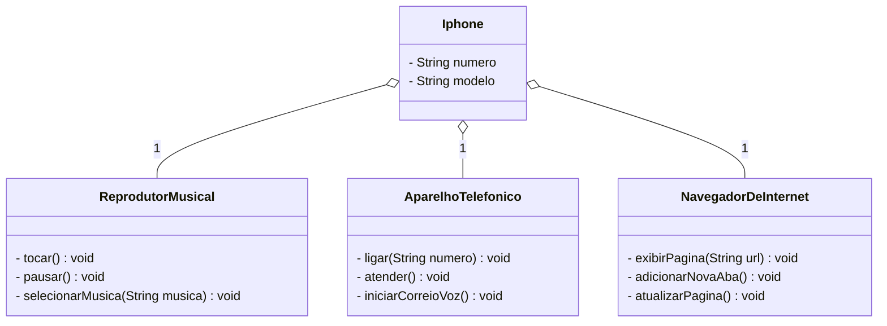

```mermaid
classDiagram
    class Iphone {
    - String numero
    - String modelo
    }
    
        class ReprodutorMusical {
            - tocar() void
            - pausar() void
            - selecionarMusica(String musica) void
        }
    
        class AparelhoTelefonico {
            - ligar(String numero) void
            - atender() void
            - iniciarCorreioVoz() void
        }
    
        class NavegadorDeInternet {
            - exibirPagina(String url) void
            - adicionarNovaAba() void
            - atualizarPagina() void
        }
    
        Iphone o-- ReprodutorMusical : 1
        Iphone o-- AparelhoTelefonico : 1
        Iphone o-- NavegadorDeInternet : 1
```